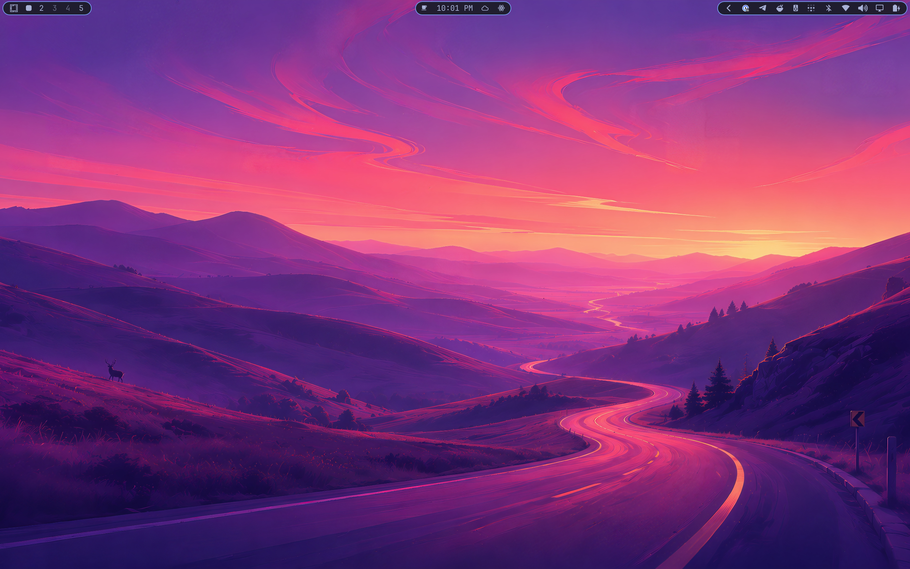
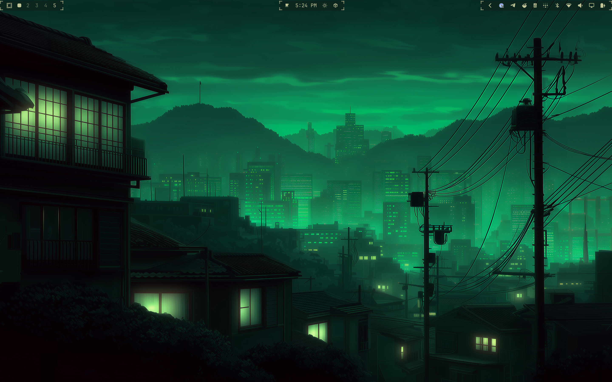
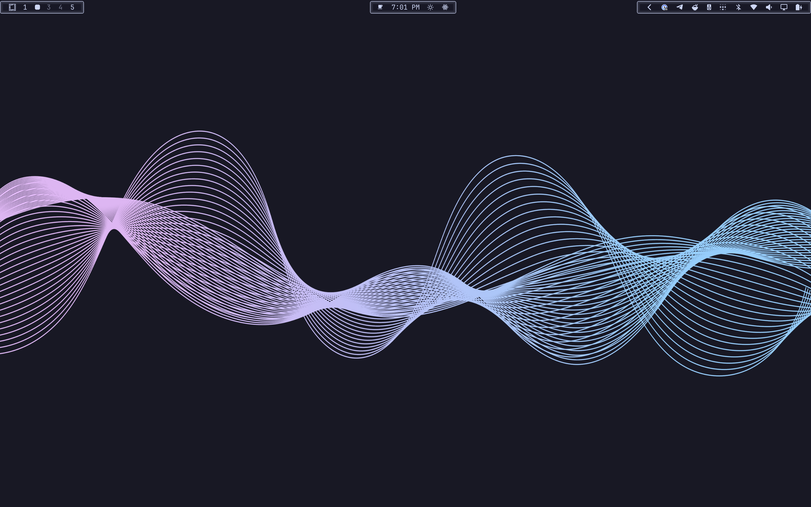
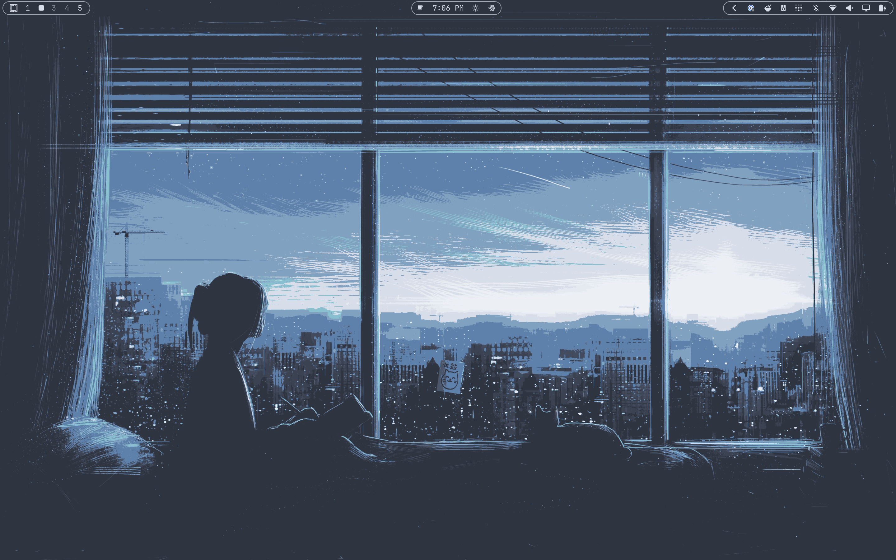
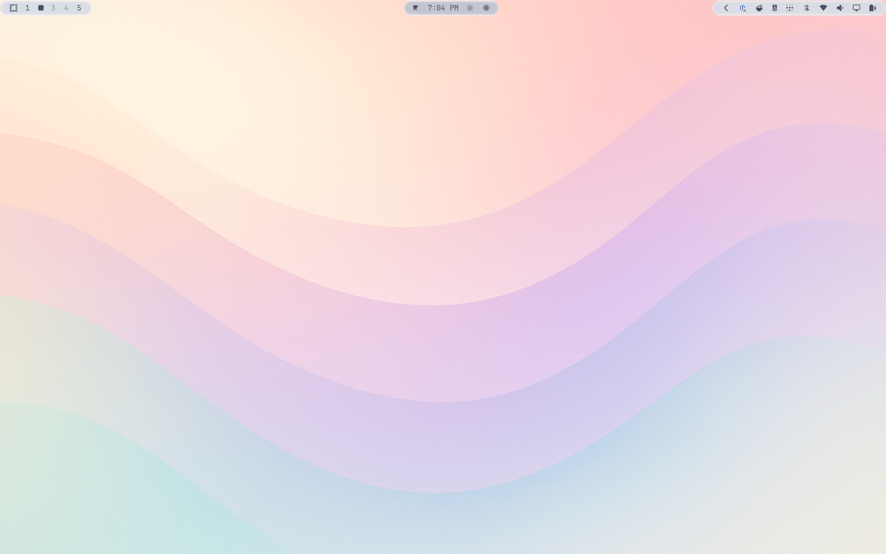
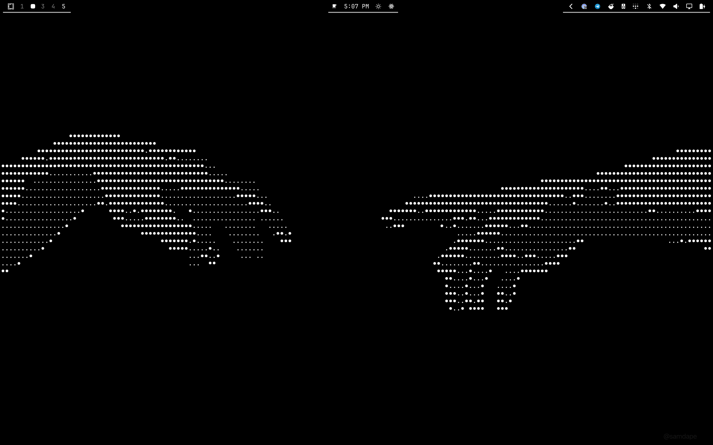
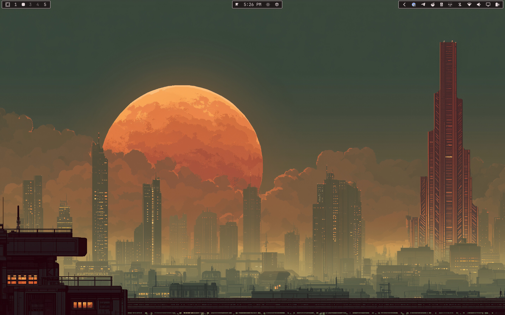
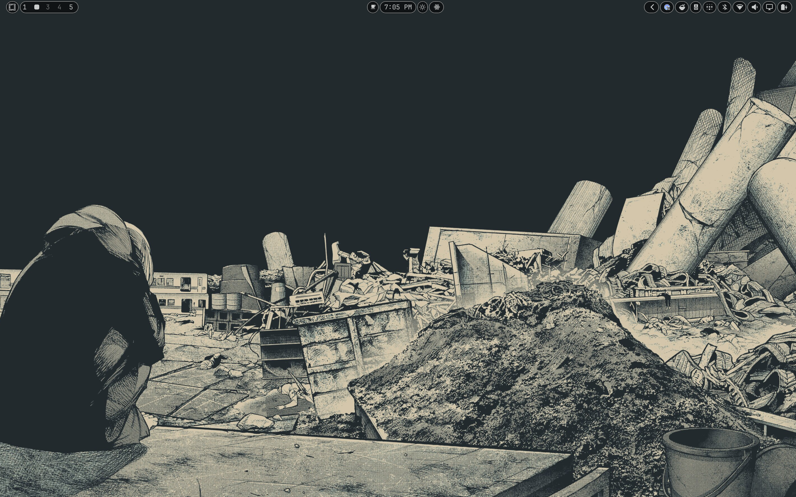
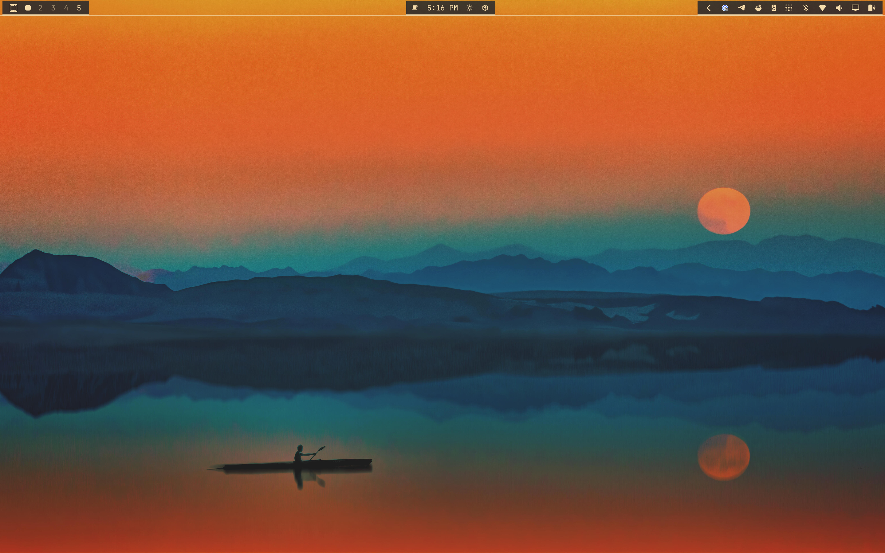

# Rice Bar

[](https://ko-fi.com/scottangel)

Theme-aware visual presets for the **stock Omarchy Quattro bar**.



Rice Bar follows one rule:

> **Own the chrome, not the widgets.**

It keeps `omarchy.bar` active and leaves Omarchy's official logo, workspaces, indicators, clock, tray, panels, gestures, keyboard navigation, drag/reorder behavior, multi-monitor routing, and shell configuration under Omarchy's control. A passive bottom-layer surface draws behind the live stock widgets and never receives pointer or keyboard input.

## Styles

| Style | What changes |
|---|---|
| **Default** | Restores the unmodified stock bar. |
| **Islands** | Rounded left, center, and right surfaces. This is the default Rice Bar style. |
| **Pills** | A compact capsule behind each visible widget. |
| **Material** | Soft tonal section cards with a stronger center surface. |
| **Outline** | Nearly transparent sections defined by crisp accent outlines. |
| **Rail** | A continuous inner-edge rail with brighter section segments. |
| **Bracket** | Technical accent corner brackets around each stock section. |
| **Glow** | Dark translucent surfaces with layered accent outlines. |
| **Powerline** | Angular section backplates inspired by classic Unix bars. |
| **Mono** | Sharp, high-contrast cards with restrained theme-text borders. |
| **Minimal** | Theme-accent rules on the bar's inner edge. |

All Rice Bar styles bind to Omarchy's active `Color.bar.background`, `Color.bar.text`, and `Color.accent` roles. Rice Bar does not ship a separate color theme.

## Examples

| Bracket | Glow |
|---|---|
|  |  |

| Islands | Material |
|---|---|
|  |  |

| Minimal | Mono |
|---|---|
|  |  |

| Outline | Pills |
|---|---|
|  |  |

| Powerline | Rail |
|---|---|
|  |  |

## Install

```bash
omarchy plugin add https://github.com/jcarcinogen/omarchy-rice-bar.git --enable --yes
```

The rice-bowl button is added to the right section. Select it to open Rice Bar settings.

## Configure

The settings panel exposes:

- Style
- Surface opacity
- Corner radius
- Breathing room
- Accent border
- A **Restore _Style_ defaults** button for the selected style

Each style starts with appearance values chosen for its visual inspiration. Slider and border changes are saved only for the selected style; switching away and back restores that style's saved values. The restore button clears only that style's customization and reloads its built-in values.

Rice Bar derives surfaces and accents from the live Omarchy `Color.bar` palette. If a theme's bar background, text, and accent are too similar, it selects a contrasting theme-compatible surface and maintains a visibility floor so chrome does not disappear into the wallpaper. Theme changes repaint live; saved opacity remains an intensity control rather than allowing an unreadable surface.

You can also switch styles through Omarchy shell IPC:

```bash
omarchy-shell rice-bar style islands
omarchy-shell rice-bar style pills
omarchy-shell rice-bar style material
omarchy-shell rice-bar style outline
omarchy-shell rice-bar style rail
omarchy-shell rice-bar style bracket
omarchy-shell rice-bar style glow
omarchy-shell rice-bar style powerline
omarchy-shell rice-bar style mono
omarchy-shell rice-bar style minimal
omarchy-shell rice-bar style omarchy
omarchy-shell rice-bar status
```

`style omarchy` selects the unmodified stock bar. The panel's restore button resets the currently selected style rather than changing styles.

Settings remain inline on Rice Bar's entry in `~/.config/omarchy/shell.json`; no sidecar configuration file is created.

## Compatibility

Developed and live-tested on:

- Omarchy `4.0.1-1`
- Quickshell `0.3.1-1`
- Stock `omarchy.bar`
- Top, bottom, left, and right bar positions
- Matte Black and Flexoki Light themes

Rice Bar is deliberately an **Option A stock-bar overlay**, not a `bar` replacement. The active bar ID remains `omarchy.bar`.

No extra packages. No sudo or pkexec is required.

## Behavior preserved

Rice Bar's overlay uses `WlrLayer.Bottom` with an empty input region. It does not replace or intercept:

- Official Omarchy menu logo or menu actions
- Workspace selection and scrolling
- Widget left, right, or middle clicks
- Widget scrolling and hover behavior
- Tooltips
- Tray ownership and expansion
- Panels and their keyboard shortcuts
- Panel arrow, Return, Tab, and Escape navigation
- Widget drag/reorder
- Bar edge movement
- Transparent-mode gesture
- Bar hide/show and panel access while hidden
- Multi-monitor widget instances and focused-monitor routing

The release acceptance contract is the official [Omarchy Top Bar manual](https://omarchy.org/manual/the-top-bar).

## Development

```bash
node --test tests/*.test.js
omarchy plugin validate .
```

For live development, place the repository under:

```text
~/.config/omarchy/plugins/io.github.jcarcinogen.rice-bar/
```

Then reload safely:

```bash
omarchy-shell shell rescanPlugins
omarchy-restart-shell
```

Do **not** use `omarchy-refresh-shell`; it replaces the user's `shell.json` with shipped defaults.

## Uninstall

```bash
omarchy plugin remove io.github.jcarcinogen.rice-bar
```

Disabling or removing Rice Bar restores the stock bar's captured runtime transparency state.

## License

MIT — see [LICENSE](LICENSE).
